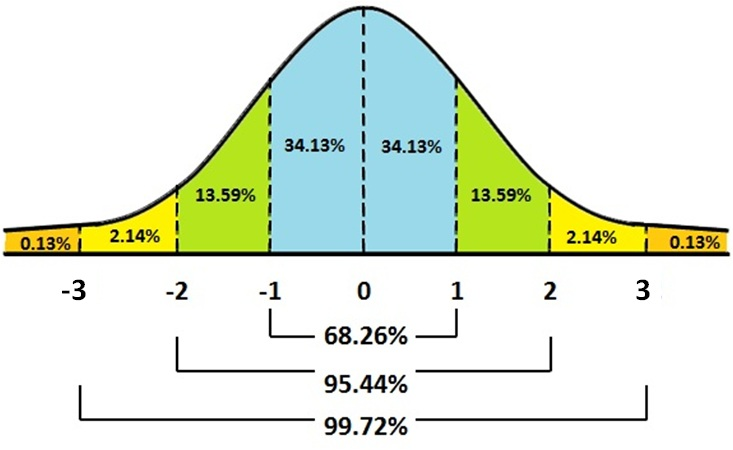

# Probability

__Probability__ tells us how likely something is to occur.  Probability concepts are also central to inferential statistics - something we will turn to shortly. Probabilities range from 0 (when there is no chance of the event occurring) to 1.0 (when the event will occur with certainty).  If you have a probability outside the 0 - 1.0 range, you have made an error!  Colloquially we often interchange probabilities and percentages, but probabilities refer to single events while percentages refer to the portion of repeated events that we get the outcome we are interested in.  As of this writing, Victor Martinez is hitting .329 which means each time he comes to bat he has a .329 probability of getting a hit or, 32.9\% of the times that he bats he gets a hit.  We symbolize probabilities as the P(A), where A is that Victor Martinez gets a hit.   Of course the probability that the event will not occur is 1 - P(A).

## Finding Probabilities

There are two basic ways to find __simple probabilities__.  One way to find a probability is _a priori_, or using logic without any real world evidence or experience.  If we know a die is not loaded, we know the probability of rolling a two is 1 out of 6 or .167.  Probabilities are easy to find if every possible outcome has the same probability of occurring.  If that is the case, the probability is number of ways your outcome can be achieved over all possible outcomes.  

The second method to determine a probability is called _posterior_, which uses the experience and evidence that has accumulated over time to determine the likelihood of an event.  If we do not know that the probability of getting a head is the same as the probability of getting a tail when we flip a coin (and, therefore, we cannot use an a priori methodology), we can flip the coin repeatedly.  After flipping the coin, say, 6000 times, if we get 3000 heads you can conclude the probability of getting a head is .5, i.e., 3000 divided by 6000.
  
Sometimes we want to look at probabilities in a more complex way.  Suppose we want to know how Martinez fares against right-handed pitchers.  That kind of probability is referred to as a __conditional probability__.  The formal way that we might word that interest is: what is Martinez's probability of getting a hit given that the pitcher is right-handed?  We are establishing a condition (right-handed pitcher) and are only interested in the cases that satisfy the condition.  The calculation is the same as a simple probability, but it eliminates his at-bats against lefties and only considers those at bats against right-handed pitchers.   In this case, he has 23 hits in 56 at bats (against right-handed pitchers) so his probability of getting a hit against a right-handed pitcher is $23/56$ or .411.  (This example uses the posterior method to find the probability, by the way.)  A conditional probability is symbolized as $P(A|B)$ where A is getting a hit and B is the pitcher is right-handed.  It is read as the probability of A given B or the probability that Martinez will get a hit given that the pitcher is right-handed.

Another type of probability that we often want is a joint probability.  A __joint probability__ tells the likelihood of two (or more) events both occurring.   Suppose you want to know the probability that you will like this course and that you will get an A in it, simultaneously -- the best of all possible worlds.   The formula for finding a joint probability is:

\begin{equation}
  P(A \cap B) = P(A) * P(B|A) or P(B) * P(A|B)
\end{equation}

The probability of two events occurring at the same time is the probability that the first one will occur times the probability the second one will occur given that the first one has occurred.  

If events are independent the calculation is even easier.  Events are independent if the occurrence or non-occurrence of one does not affect whether the other occurs.  Suppose you want to know the probability of liking this course and not needing to get gas on the way home (your definition of a perfect day).  Those events are presumably independent so the $P(B|A) = P(B)$ and the joint formula for independent events becomes:

%need to convert this to other style equation
\begin{equation}
  P(A \cap B) = P(A) * P(B)
\end{equation}

The final type of probability is the union of two probabilities.  The __union of two probabilities__ is the probability that either one event will occur or the other will occur -- either, or, it does not matter which one.  You might go into a statistics class with some dread and you might say a little prayer to yourself: ``Please let me either like this class or get an A.  I do not care which one, but please give me at least one of them."  The formula and symbols for that kind of probability is:

\begin{equation}
  P(A \cup B) = P(A) + P(B) - P(A \cap B)
\end{equation}

It is easy to understand why we just add the $P(A)$ and the $P(B)$ but it may be less clear why we subtract the joint probability.   The answer is simple - because we counted where they overlap twice (those instances in both A and in B) so we have to subtract out one instance.  

If, though, the events are mutually exclusive, we do not need to subtract the overlap.  Mutually exclusive events are events that cannot occur at the same time, so there is no overlap.  Suppose you are from Chicago and will be happy if either the Cubs or the White Sox win the World Series.  Those events are mutually exclusive since only one team can win the World Series so to find the union of those probabilities we simple have to add the probability of the Cubs winning to the probability of the White Sox winning.

## Finding Probabilities with the Normal Curve
If we want to find the probability of a score falling in a certain range, e.g., between 3 and 7, or more than 12, we can use the normal to determine that probability.  Our ability to make that determination is based on some known characteristics on the normal curve.  We know that for all normal curves 68.26\% of all scores fall within one standard deviation of the mean, that 95.44\% fall within two standard deviations, and that 99.72\% fall within three standard deviations.  (The normal distribution is dealt with more formally in the next chapter.) So, we know that something that is three or more standard deviations above the mean is pretty rare.  Figure \@ref(fig:normcurve) illustrates the probabilities associated with the normal curve.^[Source availavle [here.](http://whatilearned.wikia.com/wiki/File:Normal_curve_probability.jpg)]

```{r normcurve, echo=FALSE, fig.cap="Area under the Normal Curve"}

```

According to Figure \@ref(fig:normcurve), there is a .3413 probability of an observation falling between the mean and one standard deviation above the mean and, therefore, a .6826 probability of a score falling within $(+/-)$ one standard deviation of the mean.   There is also a .8413 probability of a score being one standard deviation above the mean or less (.5 probability of a score falling below the mean and a .3413 probability of a score falling between the mean and one standard deviation above it).   (Using the language we learned in Chapter 3, another way to articulate that finding is to say that a score one standard deviation above the mean is at the 84th percentile.)  There is also a .1587 probability of a score being a standard deviation above the mean or higher $(1.0 - .8413)$. 

Intelligence tests have a mean of 100 and a standard deviation of 15.  Someone with an IQ of 130, then, is two standard deviations above the mean, meaning they score higher than 97.72\% of the population.  Suppose, though, your IQ is 140.  Using Figure \@ref(fig:normcurve) would enable us only to approximate how high that score is.  To find out more precisely, we have to find out how many standard deviations above the mean 140 is and then go to a more precise normal curve table.

To find out how many standard deviations from the mean an observation is, we calculated a standardized, or __Z-score__.  The formula to convert a raw score to a Z-score is:

\begin{equation}
Z = \frac{x-\mu}{\sigma}
\end{equation}

In this case, the $Z$-score is $140-100/15$ or $2.67$.  Looking at the formula, you can see that a Z-score of zero puts that score at the mean; a $Z$-score of one is one standard deviation above the mean; and a $Z$-score of $2.67$ is $2.67$ standard deviations above the mean.

The next step is to go to a normal curve table to interpret that Z-score.  Table \@ref(fig:Normal_Curve) at the end of the chapter contains such a table.  To use the table you combine rows and columns to find the score of 2.67.  Where they cross we see the value .4962.  That value means there is a .4962 probability of scoring between the mean and a $Z$-score of 2.67.  Since there is a .5 probability of scoring below the mean adding the two values together gives a .9962 probability of finding an IQ of 140 or lower or a .0038 probability of someone having an IQ of 140 or better.

#### Bernoulli Probabilities {-}
We can use a calculation known as the Bernoulli Process to determine the probability of a certain number of successes in a given number of trials.  For example, if you want to know the probability of getting exactly three heads when you flip a coin four times, you can use the Bernoulli calculation.  To perform the calculation you need to determine the number of trials $(n)$, the number of successes you care about $(k)$, the probability of success on a single trial $(p)$, and the probability $(q)$ of not a success $(1-p$ or $q)$.  The operative formula is:

\begin{equation}
 \left(\frac{n!}{k!(n-k)!}\right) * p^k * q^{n-k}
\end{equation}

The symbol $n!$ is ``n factorial" or $n*(n-1)*(n-2)$ ... $* 1$.  So if you want to know the probability of getting three heads on four flips of a coin, $n=4$, $k=3$, $p=.5$, and $q=.5$:

\begin{equation}
  \left(\frac{4!}{3!(4-3)!}\right) * .5^3 * .5^{4-3} = .25
\end{equation}

The Bernoulli process can be used only when both $n * p$ and $n * q$ are greater than ten.  It is also most useful when you are interested in exactly $k$ successes.  If you want to know the probability of $k$ or more, or $k$ or fewer successes, it is easier to use the normal curve.  Bernoulli could still be used if your data is discrete, but you would have to do repeated calculations.


## Summary
Probabilities are simple statistics but are important when we want to know the likelihood of some event occurring.  There are frequent real world instances where we find that information valuable.  We will see, starting in the next chapter, that probabilities are also central to the concept of inference.


```{r Normal_Curve, echo=FALSE, fig.cap="The Normal Curve Table"}
knitr::include_graphics("Normal-Curve.png")
```