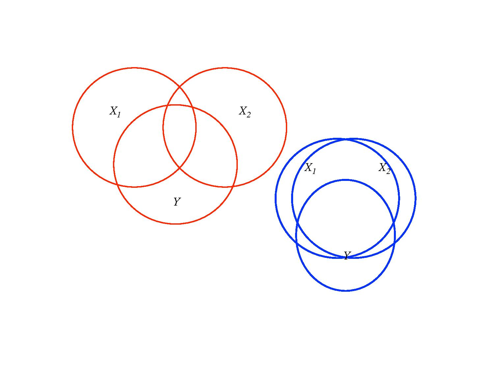

# The Logic of Multiple Regression

The logic of multiple regression can be readily extended from our earlier discussion of simple regression. As with simple regression, multiple regression finds the regression line (or regression ``plane" with multiple independent variables) that minimizes the sum of the squared errors. This chapter discusses the theoretical specification of the multiple regression model, the key assumptions necessary for the model to provide the best linear unbiased estimates (BLUE) of the effects of the $Xs$ on $Y$, the meaning of the partial regression coefficients, and hypothesis testing. Note that the examples in this chapter continue to use the class data set. 

## Theoretical Specification

As with simple regression, the theoretical multiple regression model contains a __systematic__ component --- $Y = \alpha + \beta_{1} X_{i1}+\beta_{2} X_{i2}+\ldots+\beta_{k} X_{ik}$ and a __stochastic__ component---$\epsilon_{i}$. The overall theoretical model is expressed as: 

\begin{equation*}
Y = \alpha + \beta_{1} X_{i1}+\beta_{2} X_{i2}+\ldots+\beta_{k} X_{ik}+\epsilon_{i}
\end{equation*}

where
- $\alpha$ is the constant term 
- $\beta_{1}$ through $\beta_{k}$ are the parameters of IVs 1 through k 
- $k$ is the number of IVs
- $\epsilon$ is the error term  


In matrix form the theoretical model can be much more simply expressed as: 
$y = X\beta+\epsilon$.

The empirical model that will be estimated can be expressed as: 
\begin{align*}
 Y_{i} &= A+B_{1}X_{i1}+B_{2}X_{i2}+\ldots+B_{k}X_{ik}+E_{i} \\
 &= \hat{Y_{i}}+E_{i}
\end{align*}

Therefore, the residual sum of squares (RSS) for the model is expressed as: 
\begin{align*}
RSS &= \sum E^{2}_{i} \\
&= \sum(Y_{i}-\hat{Y_{i}})^{2} \\
&= \sum(Y_{i}-(A+B_{1}X_{i1}+B_{2}X_{i2}+\ldots+B_{k}X_{ik}))^{2} 
\end{align*}

### Assumptions of OLS Regression

There are several important assumptions necessary for multiple regression. These
assumptions include linearity, fixed $X$'s, and errors that are normally distributed.

> __OLS Assumptions__
>
> _Systematic Component_
>
> - Linearity 
> - Fixed $X$  
>
> _Stochastic Component_
>
> - Errors have identical distributions
> - Errors are independent of $X$ and other $\epsilon_i$
> - Errors are normally distributed     

#### Linearity {-}

When OLS is used, it is assumed that a linear functional form is the correct specification for the model being estimated. Note that linearity is assumed in the _parameters_ (that is, for the $Bs$), therefore the expected value of the dependent variable is a linear function of the parameters, not necessarily of the variables themselves.  So, as we will discuss in later chapters, it is possible to transform the variables (the $Xs$) to introduce non-linearity into the model while retaining linear estimated coefficients. For example, a model with a squared $X$ term can be estimated with OLS:

\begin{equation*}
  Y = A + BX^{2}_i + E
\end{equation*}

However, a model with a squared $B$ term cannot. 

#### Fixed $X$ {-}

The assumption of fixed values of $X$ means that the value of $X$ in our observations is not systematically related to the value of the other $X$'s. We can see this most clearly in an experimental setting where the researcher  can manipulate the experimental variable while controlling for all other possible $Xs$ through random assignment to a treatment and control group. In that case, the value of the experimental treatment is completely unrelated to the value of the other $Xs$ -- or, put differently, the treatment variable is orthogonal to the other $Xs$. This assumption is carried through to observational studies as well. Note that if $X$ is assumed to be fixed, then changes in $Y$ are assumed to be a result of the independent variations in the $X$'s and error (and nothing else).    

## Partial Effects

As noted in Chapter 1, multiple regression ``controls" for the effects of other variables on the dependent variables. This is in order to manage possible spurious relationships, where the variable $Z$ influences the value of both $X$ and $Y$. Figure \@ref(fig:spur) illustrates the nature of spurious relationships between variables. 

```{r spur, echo=FALSE, fig.cap="Spurious Relationships"}

```

To control for spurious relationships, multiple regression accounts for the __partial effects__ of one $X$ on another $X$. Partial effects deal with the shared variance between $Y$ and the $X$'s. This is illustrated in Figure \@ref(fig:partef).  In this example, the number of deaths resulting from house fires is positively associated with the number of fire trucks that are sent to the scene of the fire. A simple-minded analysis would conclude that if fewer trucks are sent, fewer fire-related deaths would occur. Of course, the number of trucks sent to the fire, and the number of fire-related deaths, are both driven by the magnitude of the fire. An appropriate control for the size of the fire would therefore presumably eliminate the positive association between the number of fire trucks at the scene and the number of deaths (and may even  reverse the direction of the relationship, as the larger number of trucks may more quickly suppress the fire).

```{r partef, echo=FALSE, fig.cap="Partial Effects"}

```

In Figure \ref(fig:partef), the Venn diagram on the left shows a pair of $X$s that would jointly predict $Y$ better than either $X$ alone. However, the overlapped area between $X_{1}$ and $X_{2}$ causes some confusion. That would need to be removed to estimate the "pure" effect of $X_{1}$ on $Y$. The diagram on the right represents a dangerous case. Overall, $X_{1}$+$X_2$ explain $Y$ well, but we don`t know how the individual $X_1$ or $X_2$ influence $Y$.  This clouds our ability to see the effects of either of the $Xs$ on $Y$. In the extreme case of wholly overlapping explanations by the IVs, we face the condition of __multicolinearity__ that makes estimation of the partial regression coefficients (the $Bs$) impossible.
     
In calculating the effect of $X_1$ on $Y$, we need to remove the effect of the other $X$s on both $X_1$ and $Y$.  While multiple regression does this for us, we will walk through an example to illustrate the concepts. 

> __Partial Effects__
>
> In a case with two IVs, $X_1$ and $X_2$
>
>  $Y = A + B_1X_{i1} + B_2X_{i2} + E_{i}$ 
>
> - Remove the effect of $X_2$ and $Y$ 
>
>   $\hat{Y_i} = A_1+B_1X_{i2}+E_{iY|X_{2}}$  
>
> - Remove the effect of $X_2$ on $X_1$: 
>
>   $\hat{X_i} = A_2+B_2X_{i2}+E_{iX_{1}|X_{2}}$  
>
> So,
>
>   $E_{iY|X_{2}} = 0 + B_3E_{iX_{1}|X_{2}}$ 
> and 
>   $B_3E_{iX_{1}|X_{2}} = B_1X_{i1}$  

As an example, we will use age and ideology to predict perceived climate change risk. 

```{r 12ols1, echo=TRUE}
ds.temp <- filter(ds) %>% select(glbcc_risk, ideol, age) %>%
  na.omit()

ols1 <- lm(glbcc_risk ~ ideol+age, data = ds.temp)
summary(ols1)
```

Note that the estimated coefficient for ideology is -1.0427478. To see how multiple regression removes the shared variance we first regress climate change risk on age and create an object `ols2.resids` of the residuals. 

```{r 12ols2, echo=TRUE}
ols2 <- lm(glbcc_risk ~ age, data = ds.temp)
summary(ols2)
ols2.resids <- ols2$residuals 
```

Note that, when modeled alone, the estimated effect of age on glbccrsk is larger (-0.0164) than it was in the multiple regression with ideology (-0.00487). This is because age is correlated with ideology, and -- because ideology is also related to glbccrsk -- when we don't "control for" ideology, the age variable carries some of the influence of ideology.

Next, we regress ideology on age and create an object of the residuals. 

```{r 12ols3, echo=TRUE}
ols3 <- lm(ideol ~ age, data = ds.temp)
summary(ols3)
ols3.resids <- ols3$residuals
```

Finally, we regress the residuals from ols2 on the residuals from ols3. Note that this regression does not include an intercept term. 

```{r 12ols4, echo=TRUE}
ols4 <- lm(ols2.resids ~ 0 + ols3.resids)
summary(ols4)
```

As shown, the estimated $B$ for $E_{iX_{1}|X_{2}}$, matches the estimated $B$ for ideology in the first regression. What we have done, and what multiple regression does, is ``clean" both $Y$ and $X_1$ (ideology) of their correlations with $X_2$ (age) by using the residuals from the bivariate regressions.
 
## Multiple Regression Example

```{r scatplot, echo=TRUE, message=FALSE, warning=FALSE}
library(psych)
describe(data.frame(ds.temp$glbcc_risk,ds.temp$ideol,
                    ds.temp$age))
library(car)
scatterplotMatrix(data.frame(ds.temp$glbcc_risk,
                             ds.temp$ideol,ds.temp$age),
                  diagonal="density")
```

In this section, we walk through another example of multiple regression. First, we start with our two IV model. 

```{r 12ols6, echo=TRUE}
ols1 <- lm(glbcc_risk ~ age+ideol, data=ds.temp)
summary(ols1)
```

The results show that the relationship between age and perceived risk (glbccrsk) is negative and insignificant. The relationship between ideology and perceived risk is negative and significant. The coefficients of the $X$'s are interpreted in the same way as with simple regression, except that we are now controlling for the effect of the other $X$'s by removing their influence on the estimated coefficient. Therefore, we say that as ideology increases one unit, perceptions of the risk of climate change (glbccrsk) decrease by -1.0427478, controlling for the effect of age.  

As was the case with simple regression, multiple regression finds the intercept and slopes that minimize the sum of the squared residuals. With only one IV the relationship can be represented in a two-dimensional plane (a graph) as a line, but each IV adds another dimension. Two IVs create a regression plane within a cube, as shown in Figure \@ref(fig:scatols). The Figure shows a scatterplot of perceived climate change risk, age, and ideology coupled with the regression plane. Note that this is a sample of 200 observations from the larger data set. Were we to add more IVs, we would generate a hypercube... and we haven't found a clever way to draw that yet.

```{r scatols, echo=TRUE, fig.cap="Scatterplot and Regression Plane of gcc risk, age, and ideology"}
ds200 <- ds.temp[sample(1:nrow(ds.temp), 200, replace=FALSE),]
library(scatterplot3d)  
s3d <-scatterplot3d(ds200$age,
                    ds200$ideol,
                    ds200$glbcc_risk
                    ,pch=16, highlight.3d=TRUE,  
type="h", main="3D Scatterplot")
s3d$plane3d(ols1)
```

In the next example education is added to the model. 

```{r plused, eccho=TRUE}
ds.temp <- filter(ds) %>%
  select(glbcc_risk, age, education, income, ideol) %>%
  na.omit()

ols2 <- lm(glbcc_risk ~ age + education + ideol, data = ds.temp)
summary(ols2)
```

We see that as a respondent's education increases one unit on the education scale, perceived risk appears to increase by 0.0367752, keeping age and ideology constant. However, this result is not significant. In the final example, income is added to the model. Note that the size and  significance of education actually increases once income is included, indicating that education only has  bearing on the perceived risks of climate change once the independent effect of income is considered.

```{r 12ols7, echo=TRUE}
options(scipen = 999) #to turn off scientific notation
ols3 <- lm(glbcc_risk ~ age + education + income + ideol, data = ds.temp)
summary(ols3)
```

### Hypothesis Testing and $t$-tests

The logic of hypothesis testing with multiple regression is a straightforward extension from  simple regression as described in Chapter 7. Below we will demonstrate how to use the standard error of the ideology variable to test whether ideology influences perceptions of the perceived risk of global climate change. Specifically, we posit:

> $H_1$: As respondents become more conservative, they will perceive climate change to be less risky, all else equal. 

Therefore, $\beta_{ideology} < 0$. The null hypothesis is that $\beta_{ideology} = 0$. 

To test $H_1$ we first need to find the standard error of the $B$ for ideology, ($B_j$).  

\begin{equation}
  SE(B_j) = \frac{S_E}{\sqrt{RSS_j}} 
  (\#eq:12-1)
\end{equation}

where $RSS_j =$ the residual sum of squares from the regression of $X_j$ (ideology) on the other $X$s (age, education, income) in the model. $RSS_j$ captures all of the __independent__ variation in $X_j$. Note that the bigger $RSS_j$, the smaller $SE(B_j)$, and the smaller $SE(B_j)$, the more precise the estimate of $B_j$.
 
$S_E$ (the standard error of the model) is:

\begin{equation*}
 S_E = \sqrt{\frac{RSS}{n-k-1}}
\end{equation*}

We can use `R` to find the $RSS$ for ideology in our model. First we find the $S_E$ of the model: 

```{r stanerr, echo=TRUE}
Se <- sqrt((sum(ols3$residuals^2))/(length(ds.temp$ideol)-5-1))
Se
```

Then we find the $RSS$, for ideology:

```{r 12ols8, echo=TRUE}
ols4 <- lm(ideol ~ age + education + income, data = ds.temp)
summary(ols4)
RSSideol <- sum(ols4$residuals^2)
RSSideol
```

Finally, we calculate the $SE$ for ideology:

```{r seideol, echo=TRUE}
SEideol <- Se/sqrt(RSSideol)
SEideol
```

Once the $SE(B_j)$ is known, the $t$-test for the ideology coefficient
can be calculated. The $t$ value is the ratio of the estimated coefficient to its standard error. 

\begin{equation}
  t = \frac{B_j}{SE(B_j)}
  (\#eq:12-2)
\end{equation}

This can be calculated using `R`.

```{r 12ols9, echo=TRUE}
ols3$coef[5]/SEideol
```

As we see, the result is statistically significant, and therefore we reject the null hypothesis.  Also note that the results match those from the `R` output for the full model, as was shown earlier.

## Summary
The use of multiple regression, when compared to simple bivariate regression, allows for more sophisticated and interesting analyses. The most important feature is the ability of the analyst (that's you!) to statistically control for the effects of all other IVs when estimating any $B$.
In essence, we ``clean" the estimated relationship between any $X$ and $Y$ of the influence of all  other $Xs$ in the model. Hypothesis testing in multiple regression requires that we identify the independent variation in each $X$, but otherwise the estimated standard error for each $B$ is analogous to that for simple regression.

So, maybe it's a little more complicated. But look at what we can observe! Our estimates from the examples in this chapter show that age, income and education are all related to political ideology, but even when we control for their effects, ideology retains a potent influence on the perceived
risks of climate change. Politics matter.

```{r remove, echo=FALSE}
rm(ds.temp)
```