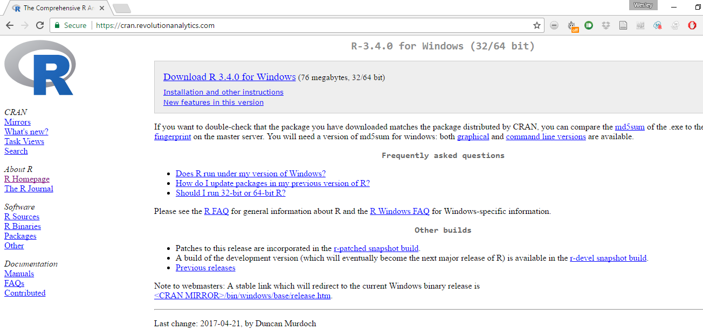

# Appendix: Basic R

This Appendix willl introduce you to the basics of programming languages, such as  R, as well as explain why we have chosen to use R in our course and this textbook. Then we will provide you with some basic programming skills in R that are generally unrelated to the use of R as a statistical software such as downloading, reading, manipulating and writing data. In so doing, we will prepare and introduce you to the data used throughout the book and for the accompanying exercises. 

## Introduction to R

R is a language and environment for statistical computing and graphics. It was developed at Bell Laboratories (formerly AT\&T, now Lucent Technologies) by John Chambers and colleagues. It is based off of another language called S. R is an integrated suite of software facilities for data manipulation, calculation, and graphical display. It includes:

- an effective data handling and storage facility,
- a suite of operators for calculations on arrays, in particular matrices,
- a large, coherent, integrated collection of intermediate tools for data analysis,
- graphical facilities for data analysis and display either on-screen or on hardcopy, and
- a well-developed, simple and effective programming language which includes conditionals, loops, user-defined recursive functions, and input and output facilities.

R is a powerful and effective tool for computing, statistics and analysis, and producing graphics. However, many applications exist that can do these or similar things. R has a number of benefits that make it particularly useful for a book such as this. First, similar to the book itself, R is open source and free. This comes with a set of associated advantages. Free is, of course, the best price. Additionally, this allows you, the student or reader, to take this tool with you wherever you go. You are not dependent on your employer to buy or have a license of a particular software. This is especially relevant as other software with similar functionality often cost hundreds, if not thousands, of dollars for a single license. The open source nature of R has resulted in a robust set of users, across a wide variety of disciplines--including political science--who are constantly updating and revising the language. R therefore has some of the most up-to-date and innovative functionality and methods available to its users should they know where to look. Within R, these functions and tools are often implemented as packages. Packages allow advanced users of R to contribute statistical methods and computing tools to the general users of R. These packages are reviewed and vetted and then added to the CRAN repository. Later, we will cover some basic packages used throughout the book. The CRAN repository is where we will download R.

## Downloading R and RStudio

In this section we will provide instructions to downloading R and RStudio. RStudio is an integrated development environment (IDE) that makes R a bit more user-friendly. In the class associated with this text, RStudio will primarily be used; however, it should be noted other IDEs exist for R. Additionally, R can be used without the aid of an IDE should you decide to do so. 

First, to download R, we need to go to the R project website repository as mentioned before. This can be found [here](https://www.r-project.org/}{here). This website has many references relevant to R Users. To download R, go to the [CRAN](https://cran.r-project.org/mirrors.html). It is recommended that individuals choose the mirror that is nearest their actual location. (For the purposes of this class, we therefore recommend the Revolution Analytics mirror in Dallas, though really any Mirror will do just fine.) Once here, you will want to click the link that says "Download R" for your relevant operating system (Mac, Windows, or Linux). On the next page, you will click the link that says "install R for the first time." This will open a page that should look something like this:

```{r rdp, echo=FALSE, fig.cap="R Download Page"}

```

Here you will click the "Download R" link at the top of the page. This should download the Installation Wizard for R. Once this has begun, you will click through the Wizard. Unless you have particular advanced preferences, the default settings will work and are preferred. 

At this point, you now have R downloaded on your device and can be pretty much ready to go. However, as stated previously, we are also going to show you how to download RStudio. You will find the site to download RStudio [here](https://www.rstudio.com/products/rstudio/download2/).

```{r rsdp2, echo=FALSE, fig.cap="Bottom of RStudio Download Page"}
knitr::include_graphics("rsdp2.png")
```

Once here, you will scroll down until it looks like the screen in \@ref{fig:rsdp2}. Then you will want to use the links under the installer subtitle for your relevant operating system. You do not need to use the links under the zip/tarball header. As with R, you should then simply follow the default locations and settings in the Installer of RStudio. As we said before, RStudio simply makes the use of R a little easier and more user-friendly. It includes some of the functionality that often makes other statistical softwares preferred for initially teaching students statistics. Once you have R and RStudio downloaded, you are prepared to dive right in. However, before we do that we want to introduce you to some common terminology in the fields of programming--as well as statistics--that may be helpful in your understanding of R.

## Introduction to Programming

In many respects, R is a programming language similar to other languages such a Java, Python, and others. As such, it comes with a terminology that may be unfamilair to most readers. In this section we introduce some of this terminology in order to give readers the working knowledge necessary to utilize the rest of the book to the best of its ability. One particular thing to note is that R is an __object oriented__ programming language. This means the program is organized around the data we are feeding it, rather than the logical procedures used to manipulate it. This introduces the important concept of __data types and structures__. For R, and programming languages generally, there is no agreed upon or common usage of the terms __data type__ versus __data structure__. For the purposes of this book, we will attempt to use the term __data structure__ to refer to the ways in which data are organized and __data type__ to the characteristics of the particular data within the strucutre. Data types make up the building blocks of data strutures. There are many data types; we will cover only the most common ones that are releavant to our book. The first is the __character__ type. This is simply a single Unicode character. The second is a __string__. Strings are simply a set of characters. This data type can contain, among other things, respodents' names and other common text data. The next data type is the __logical__ type. This type indicates whether or not a statement or condition is True or False. It is often represented as a 0/1 in many cases. Finally, there are __numerica__ data types. One is the __integer__ which is, as you may recall, a number with nothing after the decimal point. On the other hand, the __float__ data type allows for numbers before and after the decimal point.

In R, there are  a plethora of data structures to structure our data types. We will again focus on a few common ones. Probably the simplest data structure is a __vector__. A vector is an object where all elements are of the same data type. A __scalar__ is simply a vector with only one value. For the purposes of this book, a variable is often represented as a vector or the column of a dataset. __Factors__ are vectors with a fixed set of values called levels. A common example of this in the social sciences is sex with only two levels- male or female. A __matrix__ is a two dimensional collection of values, all of the same type. Thus, a matrix is simply a collection of vectors. An __array__ is a matrix with more than 2-dimensions. The data structure we will use most is a __dataframe__. A dataframe is simply a matrix where the values do not all have to be the same type. Therefore, a dataframe can have a vector that is text data type, a vector that is numerical data type, and a vector that is a logical data type or any possible combination. Finally, __lists__ are collections of these data structures. They are essentially a method of gathering together a set of dataframes, matrices, etc. These will not commonly be used in our book but are important in many applications. Now that we have covered the basic types and structures of data, we are going to explain how to load data into R. 

## Uploading/Reading Data

R can handle a variety of different file types as data. The primary type that will be used for the book and accompanying course is a comma separated file, or .csv file type. A CSV is a convenient file type that is portable across many operating platforms (Mac, Windows, etc) as well as statistical/data manipulation softwares. Other common file types are text (.txt) and Excel files (.xls or .xlsx). R also has its own file type called a R data file with the .RData extension. Other statistical softwares also have their own file types, such as Stata's .dta file extension. R has built in functionality to deal with .csv and .txt as well as a few other file extensions. Uploading other data types requires special packages (haven, foreign, and readxl are popular for these purposes). These methods work for uploading files from the hard drives on our computers. You can also directly download data from the internet into R from a variety of sources and using a variety of packages. 

For the purposes of the book, we will acquire our data by going [here](ttp://crcm.ou.edu/epscordata/). You will then type your e-mail where it says Request Data. You should then receive an e-mail with the data attached as a .csv file. First, you will want to download this data onto your computer. We recommend creating a folder specifically for the book and its data (and if you're in the class for your classwork). This file will be your working directory. For each script we run in class, you will have to set your working directory. An easy way to do this in RStudio is to go to the Session tab. Scroll about halfway down to the option that says ""Set Working Directory" and then click "Choose Directory..." This will open up an explorer or search panel that allows you to choose the folder that you have saved the data in. This will then create a line of code in the console of RStudio that you then copy and paste into the Code editor to set the working directory for your data. You then run this code by hitting Ctrl+Enter on the highlighted line. 

Once this has been done, it is a good idea to check your directory. One easy way to do this is the `list.files()` command, which will list all files saved in the folder you have set as your working directory. 

```{r listfiles, echo=TRUE, results="hide"}
# list.files()
```

If you have done this correctly, the data you downloaded should show up as a file. Once you have done this, uploading the data will be easy. Simply write one line of code:

```{r readcsv, echo=TRUE, results="hide"}
# ds<-read.csv("w1_w13_longdata.csv")
```

This line of code loads our data saved as a .csv into R and saves it as an object (remember the object oriented programming from earlier) that we call ds (short for dataset). This is the convention for the entire book. Now that we have the data downloaded from the internet and uploaded into R, we are going to briefly introduce you to some data manipulation techniques.

## Data Manipulation in R

R is a very flexible tool for manipulating data into various subsets and forms. There are many useful packages and functions for doing this, including the dplyr package, tidyr package, and more. R and its packages will allow users to transform their data from long to wide formats, remove NA values, recode variables, etc. In order to make the downloaded data more manageable for the book, we are going to do two things. First, we want to restrict our data to one wave. The data we downloaded represent many waves of a quarterly survey that is sent to a panel of Oklahoma residents on weather, climate and policy preferences. This book will not venture into panel data analysis or time series analysis, as it is an introductory text, and therefore we simply want one cross section of data for our analysis. This can be done with one line of code:

```{r subset, echo=TRUE,results="hide"}
# ds<-subset(ds, ds$wave_id == "Wave 12 (Fall 2016)")
```

What this line of code is doing is creating an object, that we have again named ds in order to overwrite our old object, that has only the 12th wave of data from the survey. In effect, this is removing all rows in which waveid, the variable that indicates the survey wave, does not equal twelve. Across these many waves, many different questions are asked and various variables are collected. We now want to remove all columns or variables that were not collected in wave twelve. This can also be done with one line of code:

```{r remcol, echo=TRUE,results="hide"}
# ds<-ds[, !apply(is.na(ds), 2, all)]
```

This line of code is a bit more complicated, but what it is essentially doing is first searching all of ds for NA values using the is.na function. It is then returning a logical value of TRUE or FALSE---if a cell does have an NA then the value returned is TRUE and vice versa. It is then searching by column, which is represented by the number 2 (rows are represented by the number 1), to see if all of the values are TRUE or FALSE. This then returns a logical value for the column, either TRUE if all of the rows/cells are NAs or FALSE if at least one row/cell in the column is not an NA. The ! is then reversing the TRUE and FALSE meanings. Now TRUE means a column that is not all NA and therefore one we want to keep. Finally, the brackets are another way to subset our data set. This allows us to keep all columns where the returned value is TRUE, or not all values were NA. Because we are concerned with columns, we write the function after the comma. If we wanted to do a similar thing but with rows we would put the function before the comma. Finally, we want to save this dataset to our working directory which will be explained in the following section

## Saving/Writing Data

Saving or writing data that we have manipulated is a useful tool. It allows us to easily share datasets we have created with others. This is useful for collaboration, especially with other users who may not use R. Additionally, this will be useful for the book, as our new dataset is the one that will be worked with throughout the book. This dataset is much smaller than the one we originally downloaded and therefore will allow for quicker load times as well as hopefully reduce potential confusion. The code to save this data set is rather simple as well:

```{r writse, echo=TRUE,results="hide"}
# write.csv(ds, "Class Data Set.csv")
```

This line of code allows us to save the dataset we created and saved in the object named ds as a new .csv file in our working directory called ``Class Data Set." Having successfully downloaded R and RStudio, learned some basic programming and data manipulation techniques, and saved the class data set to your working directory, you are ready to use the rest of the book to its fullest potential. 

## The Tidyverse

This edition of the book employs the tidyverse family of R functions for both statistical analysis and data visualization. The tidyverse is a collection of functions that provide an efficient, consistent, and intuitive method of both working with your data and visualizing it. Packages like dplyr are used as the primary method of data exploration and wrangling, and ggplot2 is used for visualization. More information can be found about the [tidyverse](www.tidyverse.org.) 